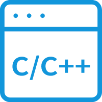
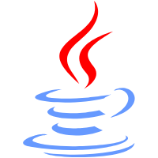
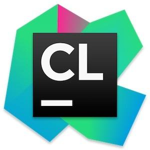
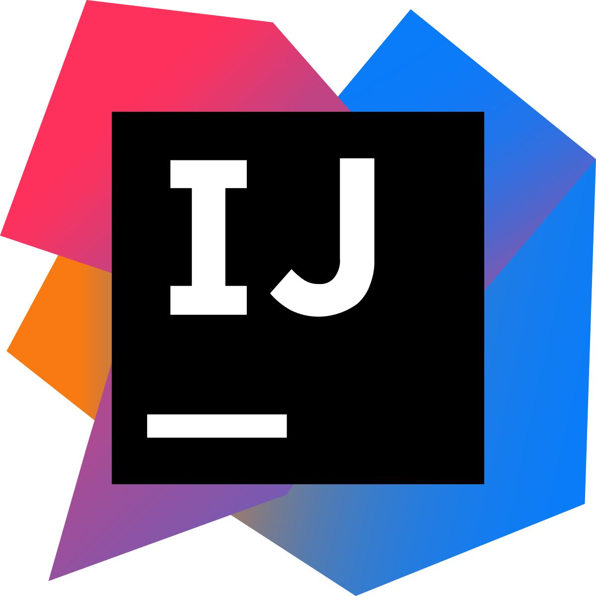
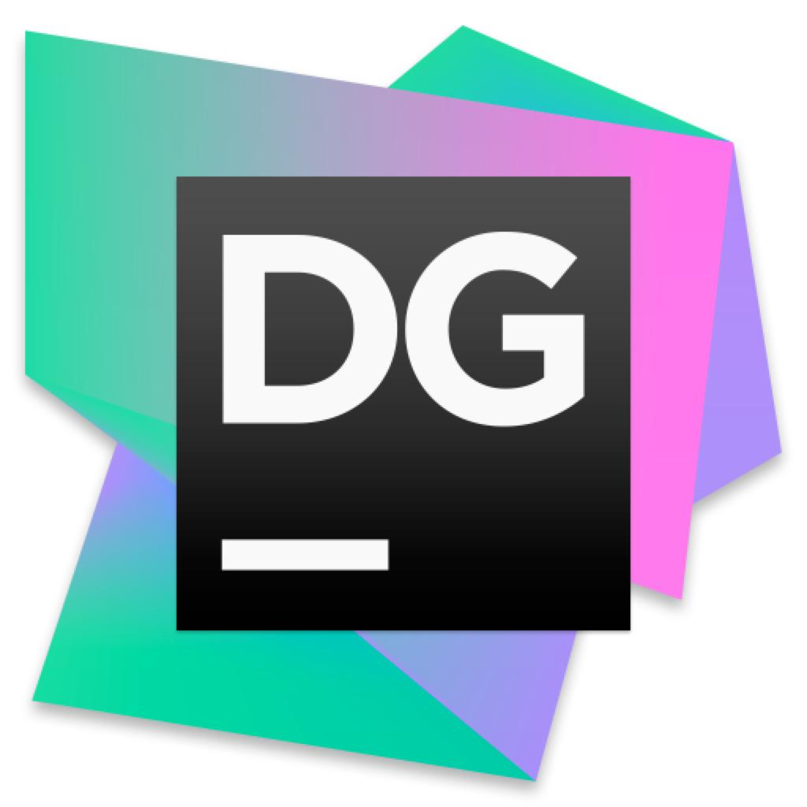

<!--
**LeeWangWang/LeeWangWang** is a ✨ _special_ ✨ repository because its `README.md` (this file) appears on your GitHub profile.

Here are some ideas to get you started:

- 🔭 I’m currently working on ...
- 🌱 I’m currently learning ...
- 👯 I’m looking to collaborate on ...
- 🤔 I’m looking for help with ...
- 💬 Ask me about ...
- 📫 How to reach me: ...
- 😄 Pronouns: ...
- ⚡ Fun fact: ...
-->

- 🏫 &nbsp; I'm [LeeWangWang](https://leewangwang.github.io/), pursing Master from <a href="https://www.dlmu.edu.cn/">@DMU  </a>
- 🔭 &nbsp;  I’m currently working on  **DMU software Engineering Institute**
- 🌱 &nbsp; I’m currently Working with **Anomaly Log Detective**

### Languages :

 &nbsp; &nbsp; &nbsp; &nbsp; &nbsp; &nbsp;  

### Tools :

 &nbsp; &nbsp; &nbsp; &nbsp; &nbsp; &nbsp; &nbsp; &nbsp; &nbsp; &nbsp; &nbsp; &nbsp; &nbsp; &nbsp; &nbsp;

|  |  | 
| ------------- | ------------- |

 |  | 

